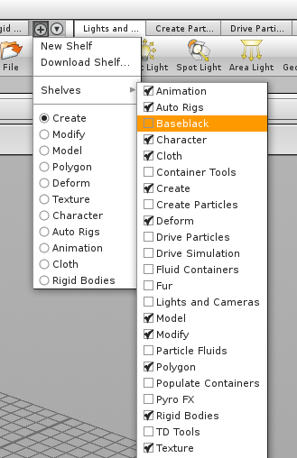
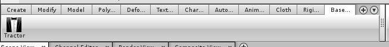
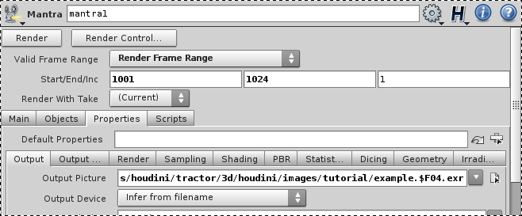
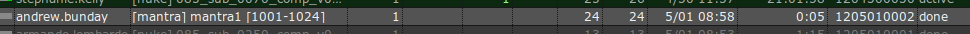

# Basics

For Houdini our approach to submitting renders to the farm is similar to that of both PRMan and Nuke. 

## Similarities to PRMan

Rather than rendering the scene file (.hip) as we would with our Mental Ray, instead we export .ifd files. These files are read by Mantra, the reyes compatible renderer for Houdini.
This means that when you submit your render, it will first sit quietly (with a progress bar) translating the scene into ifd files for each frame. Only once it has completed its translation will it submit the render to the farm. Be aware, if your translate takes a long time this can significantly add to your processing time.

## Similarities to Nuke

Rather than having one ma'husive render globals, as in Maya, Houdini instead allows the user to create multiple 'out' nodes. Much like write nodes in Nuke these contain all of the render information for the specific output. Our render submitter therefore does not try to undo this architecture and instead will only find the valid output nodes, and translate them as is, without any overrides (for now).

# How to Load the Tractor Submitter

The 'Baseblack' shelf should have already been sourced by Houdini when you launch it. To load the shelf into your current toolbar press on the '+' symbol to the right of the toolbar tabs and select 'Baseblack' from the menus.

                           

This creates the pretty barebones toolbar for Baseblack addons/shared code in Houdini. It's kinda forlorn. 
When you are ready to submit your render all you have to do is hit the icon label'd "Tractor".

                           

# Render Settings

A few notes:
The render submitter is configured to only try to submit 'Mantra' output nodes. 
You should make sure to set the 'Valid Frame Range' to 'Render Frame Range', optionally with the strick option.
Set the frame output path to anything other than 'ip'. The submitter is configured to skip over output nodes which are configured to run interactive renders.
4 frame padding in houdini is specified with $F04 in the output path string.
Remember to add a camera. Houdini won't render/export without one. The perspective view does not count.
                           
 

Once you are ready and click on the Tractor Icon the submitter script will run. It's a little chatty and will let you know if it finds outputs which can be rendered and will warn you if it cannot find any nodes which are valid *(see above).

                           

Having found all of the available, and valid render output nodes. The scene will start to be translated and houdini's default progress dialog will open to let you know how its doing.
If you wish to check on the translation output, the location of the .ifd files is configured to live under /mnt/shows/render/spool/<username>/YYYY/MM/DD/HHMMSS/<output_node_name>.$F04.ifd

Once the translation has finished it will pop up one final message box. If you forget to hit 'OK' on this all of your hard work of translating the scene will be for naught. 

                           

The submit will only take a second, so head straight over to the tractor monitor to keep any eye on your render.

                      

